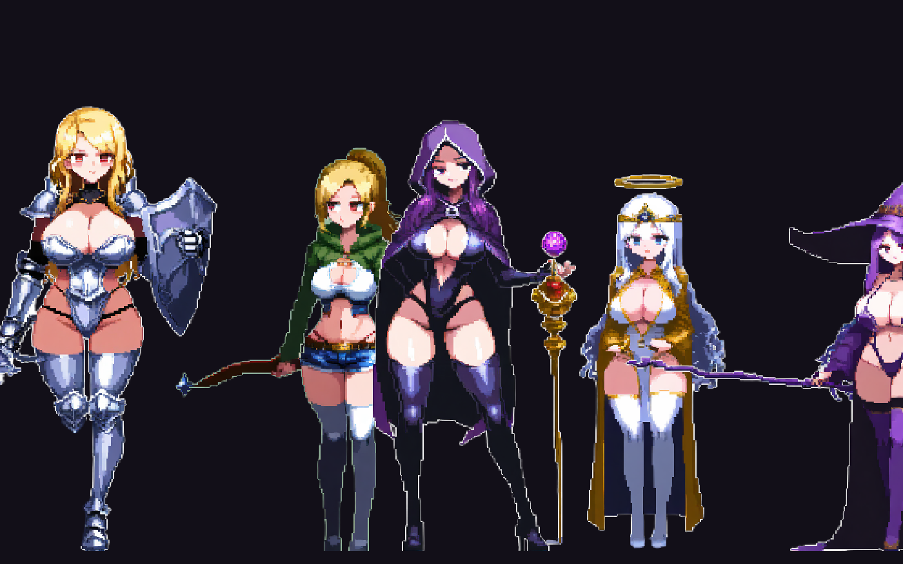
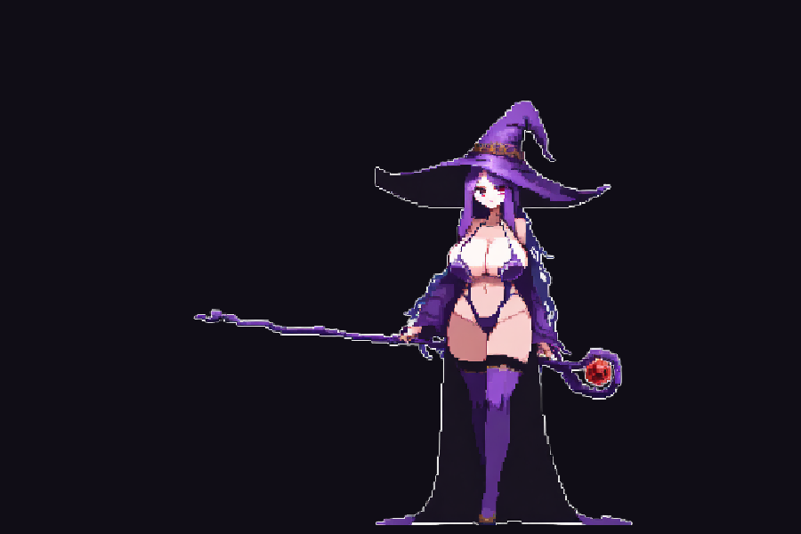

import cover from './cover.png'

export const game = {
  order: 2,
  title: 'Nightreave',
  description:
    'A dark-fantasy desktop autobattler — build a heroine, loot gear, push through gothic PvE stages, and challenge other players in asynchronous PvP. Built in Unity on a deterministic, server-verifiable combat core, with an anime pixel-art roster generated locally with Stable Diffusion.',
  abstract: (
    

      A side project built in Unity: a dark-fantasy desktop autobattler in the vein of games like Lootborne. You build a
      character, loot and optimize gear, auto-battle through a run of gothic encounters, and take your build into
      asynchronous PvP. The combat core is deterministic and headless-testable, and the entire anime pixel-art roster is
      generated locally with Stable Diffusion through a custom transparency pipeline.
    

  ),
  startDate: '2026-06-14',
  date: '2026-06-14',
  image: cover,
  href: '/games/nightreave',
  status: 'In development',
  type: 'Game / Dark-Fantasy Autobattler',
  tags: ['Unity', 'C#', 'URP 2D', 'Game Design', 'Async PvP', 'Steamworks', 'Stable Diffusion', 'ComfyUI', 'Pixel Art'],
}

export const metadata = {
  title: game.title,
  description: game.description,
  robots: { index: false, follow: false },
}

## Overview

**Nightreave** is a dark-fantasy desktop autobattler I'm building on the side, alongside a friend who ships in the same
genre. The loop is the one that makes games like *Lootborne* so sticky: build a character, loot gear, push through stage
after stage of PvE, then throw your build against other players in asynchronous duels — all while the battle plays out in
a gothic, blood-moon world.

It's a 2D Unity game with a clean split between the simulation and the renderer, so the fight that decides a PvP duel is
the same deterministic function whether it runs on screen or on a server.

## The roster

The cast is a roster of anime pixel-art heroines — a sword-and-shield knight, an archer, a hooded assassin, a priestess,
and a witch — each pulling toward a different build. Every character is generated locally with Stable Diffusion and run
through a custom cleanup pipeline (more on that below), so the whole roster shares one cohesive look.

## Combat & progression

The design goal is a fight that's **satisfying to watch and deep to optimize** without moment-to-moment micromanagement.

- **Deterministic engine.** Combat lives in a pure C# core with no Unity dependencies. A battle is a seeded simulation,
  so `result = f(seed, loadout)` — the same inputs always produce the same fight. That makes it fully reproducible and
  **headless-testable** (the core ships with a passing test suite), and it's what lets a server replay and verify any
  PvP result instead of trusting the client.
- **Loot & gear.** Items roll rarities and affixes; rarer gear scales its base stats and rolls more modifiers, which
  feed a single power rating used for matchmaking. Equipment stacks into a character sheet — the thing the simulator
  actually fights with.
- **PvE stages.** You push through waves of enemies with your health carrying between fights — a push-your-luck run
  where surviving deeper is its own gamble.
- **Asynchronous PvP.** You never fight a live opponent; you fight a *snapshot* of their loadout. Upload your build, get
  matched against someone near your power, and the deterministic engine resolves the duel — so your hero fights even
  when you're offline.

## The art pipeline

Getting the art right was its own project. The roster is generated locally with **ComfyUI + Stable Diffusion**
(Illustrious-XL with a pixel-art LoRA) on an RTX 4090. The hard part wasn't generating the characters — it was getting
**clean transparent sprites** out of art that was painted on a solid background.

A naive background cut leaves two problems: a bright halo around the silhouette (the edge pixels are a blend of the
character and the background), and leftover background trapped in enclosed gaps a simple fill can't reach (like the space
between a character's legs). The fix:

- **BiRefNet** for a *semantic* background cut — it understands an enclosed gap isn't part of the character, so it
  removes background a connected-region fill never could.
- **Mask erosion** to peel the outer blend ring, which kills the halo regardless of its colour.

The result is game-ready sprites that drop straight into the engine with crisp edges.

## Tech stack

| Layer | Choice |
|---|---|
| Engine | Unity (2D, URP) |
| Language | C# |
| Architecture | Pure deterministic core, separate render layer |
| Combat | Seeded, headless-testable simulation |
| Multiplayer | Asynchronous PvP (loadout snapshots, server-verifiable) |
| Platform | Windows desktop, Steam (Steamworks) |
| Art | ComfyUI · Stable Diffusion (Illustrious-XL + LoRA) · BiRefNet · custom Python pipeline |

Keeping the simulation free of Unity is the throughline — it's what makes the determinism, the headless tests, and the
server-verifiable PvP all fall out of the same design.

## Roadmap

- **Phase 1 — Core systems** *(done)*: the deterministic combat engine, the loot/affix/equipment model, multi-wave PvE,
  and the async-PvP duel flow — all verified in headless tests.
- **Phase 2 — Art & presentation** *(in progress)*: the AI art pipeline, the anime roster, and a first playable battle
  scene with real characters and backgrounds.
- **Phase 3 — The game around the fight** *(next)*: sectors and a run structure, the character and inventory screens,
  and the PvP ladder with seasons and ranks.
- **Later**: the desktop-overlay battle (the fight rendered transparently at the edge of your screen), a Steam economy,
  and more content.

## Status

Early but real. The core systems are built and tested, the art pipeline produces a cohesive roster, and the first battle
scene runs end-to-end with generated characters on a gothic backdrop. This page is a living dev log — I'll keep adding
milestones and screenshots as it comes together.
