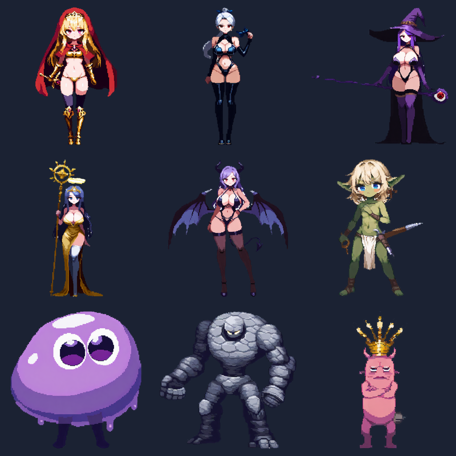
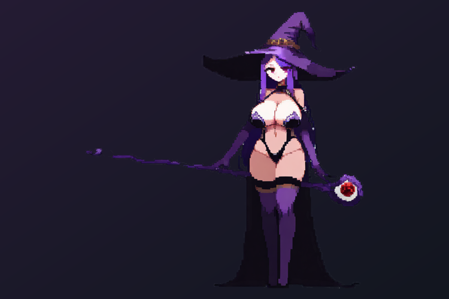

import cover from './cover.png'

export const game = {
  order: 0,
  title: 'Wayfarer',
  description:
    'A browser-based roguelite gacha — a team of anime heroes auto-battles down a branching map while you draft a Path-of-Exile-style build between fights. Built from scratch in TypeScript and Phaser, with a fully AI-generated art pipeline running locally.',
  abstract: (
    

      A side project: a lightweight, browser-playable roguelite gacha inspired by Capybara Go! and PoE&apos;s
      theorycrafting. A deterministic, headless-testable combat engine drives auto-battles down a branching run map,
      and the entire character roster is generated locally with Stable Diffusion through a custom transparency pipeline.
    

  ),
  startDate: '2026-06-01',
  date: '2026-06-14',
  image: cover,
  href: '/games/wayfarer',
  status: 'In development',
  type: 'Game / Roguelite Gacha',
  tags: ['TypeScript', 'Phaser 3', 'Vite', 'Game Design', 'Stable Diffusion', 'ComfyUI', 'Pixel Art'],
}

export const metadata = {
  title: game.title,
  description: game.description,
  robots: { index: false, follow: false },
}

## Overview

**Wayfarer** is a browser-playable roguelite gacha I'm building on the side. You pick a hero, then auto-battle your
way down a branching map of encounters; between fights you draft skill modifiers that compound into a build. The
pitch is *Capybara Go!*'s easy-to-run loop crossed with *Path of Exile*'s "min-max but don't break it" theorycrafting —
small enough to load instantly in a browser, deep enough to keep optimizing.

The whole thing is built from scratch in TypeScript: no engine bloat, a clean separation between the game logic and
the renderer, and an art pipeline that generates the entire roster locally on my own GPU.

## The roster

Every character — heroes and monsters alike — is generated locally with Stable Diffusion, then run through a custom
cleanup pipeline (more on that below). The four starting heroes each pull toward a different build: the Knight is a
sturdy all-rounder, the Archer a fragile crit-nuker, the Mage a fire/ignite caster, and the Priestess a lifesteal
bruiser that outlasts long fights.

## Combat & the build system

The core design goal is a battle that's **fun to watch and deep to optimize** without micromanagement. The combat is
auto-resolved, with the only live input being a tap to fire a hero's ultimate at the right moment.

- **Deterministic engine.** Combat lives in a pure `core/` module with zero rendering dependencies. A battle is a
  steppable state machine seeded by a single RNG seed, so `result = f(seed, inputs)` — the same inputs always produce
  the same fight. That makes it fully reproducible and **headless-testable**: I can simulate thousands of battles in
  Node to balance the numbers before anything touches the screen.
- **Branching run map.** Encounters are laid out as a Slay-the-Spire-style DAG — you choose your path, trading safety
  for rewards, with a guaranteed rest or elite before each boss.
- **Draft-a-build progression.** Between fights you pick from skill modifiers that carry tags and stack into
  `increased` (additive) and `more` (multiplicative) buckets — the PoE damage model in miniature. Keystones swing your
  whole playstyle, and elemental ailments (ignite, chill, shock) plus lifesteal give builds their identity.

Balance was tuned by pitting AI "drafters" against the simulator until each hero lands around a 50–56% win rate in
skilled play — winnable, not trivial.

## The art pipeline

This was the deepest rabbit hole. The roster is generated locally with **ComfyUI + Stable Diffusion** (Illustrious-XL
with a pixel-art LoRA) on an RTX 4090. The hard part wasn't generating the art — it was getting **clean transparent
sprites** out of images that were painted on a solid background.

A naive background cut leaves a white halo, because the silhouette's edge pixels are a blend of the character and the
background. After a long detour through homemade heuristics (and a few dead ends), the fix turned out to be a standard
technique I should have reached for first: **alpha matting with colour decontamination** — recovering each edge
pixel's *true* colour instead of keeping the background blend. BiRefNet provides a semantic mask, and the matting
subtracts the background the edge absorbed, so the cutout is clean on **any** background.

**→ [Read the full art-pipeline deep dive](/games/wayfarer/art-pipeline)** — the whole process, the wrong turns, and
the matting maths that finally solved it.

## Tech stack

| Layer | Choice |
|---|---|
| Language | TypeScript (strict) |
| Engine | Phaser 3 |
| Build | Vite |
| Architecture | Pure `core/` logic, separate `render/` layer |
| Testing | Headless battle simulation via esbuild → Node |
| Art | ComfyUI · Stable Diffusion (Illustrious-XL + LoRA) · BiRefNet · custom `sharp` pipeline |

Keeping the game logic free of Phaser is what makes the determinism and headless testing possible — the renderer is
just one consumer of the battle's event stream.

## Roadmap

- **Phase 1 — Core loop** *(done)*: heroes, branching map, draft/build system, the auto-battle engine, and a balanced
  starting roster.
- **Phase 2 — Gacha & collection meta** *(next)*: unlocking and collecting heroes, the pull/progression layer that
  gives runs a long-term goal.
- **Phase 3 — Persistence & accounts**: saving progress across sessions.
- **Later**: more content, animated characters, and — eventually — monetization.

## Status

In active development. The core run loop plays end-to-end, the roster and art pipeline are in place, and the next big
piece is the collection meta. This page is a living dev log — I'll keep adding milestones and screenshots as it grows.
