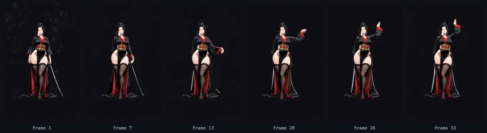

import cover from './cover.png'

export const lab = {
  order: 40,
  title: 'SpriteForge — Animating Them',
  description:
    'Turning a static character sprite into motion with Wan 2.1 image-to-video, in the smooth style — what works, where the motion control is coarse, and how the looping idle comes together.',
  abstract: (
    

      The last piece: motion. Feeding a finished sprite to an image-to-video model and getting a smooth,
      on-model animation back — a first prototype, the rough edges, and where it goes from here.
    

  ),
  startDate: '2026-06-15',
  date: '2026-06-15',
  image: cover,
  href: '/lab/spriteforge/animation',
  status: 'Prototyping',
  type: 'Dev Log / Part 4',
  tags: ['Wan 2.1', 'image-to-video', 'Animation', 'ffmpeg'],
}

export const metadata = {
  title: lab.title,
  description: lab.description,
  robots: { index: false, follow: false },
}

Part of the **[SpriteForge](/lab/spriteforge)** dev log.

## Image-to-video

The goal is motion without hand-animating anything: feed a finished sprite to **Wan 2.1 image-to-video**
plus a short motion prompt, and get a clip back. Crucially, I run it with **no style LoRA**, so the smooth
look of the source sprite is preserved frame to frame.

This first test asked the samurai to sway. Here are six frames across the clip:

**[▶ Watch the looping clip](/lab/spriteforge/samurai_loop.webp)** (a transparent animated WebP)

## What works, what's rough

- **It works, and the identity holds.** Across all 33 frames she stays on-model — same kimono, katana,
  hair. The core capability — animating the new art style cleanly — is proven.
- **Motion control is coarse.** The model interprets prompts loosely: "sway side to side" came out as a
  slow arm-raise. Getting a *subtle, specific* idle takes prompt tuning.
- **Clips don't naturally loop.** A generated clip ends in a different pose than it starts. The fix needs no
  extra compute — **ping-pong** the frames (play forward, then reverse) and any motion loops seamlessly,
  which is what the clip above does.

## Where it goes

The motion will get much more stable once each character has a [per-character
LoRA](/lab/spriteforge/consistency) — locked identity means far less frame-to-frame wander. From there the
pipeline keys out each frame's background (the same [matting](/lab/spriteforge/transparent-edges) idea,
per frame), packs them into a spritesheet for the game, and exports a shareable transparent WebP. The
whole thing already lives in the toolkit as one command (`bin/animate.mjs`).

**Back to the [SpriteForge hub →](/lab/spriteforge)**
