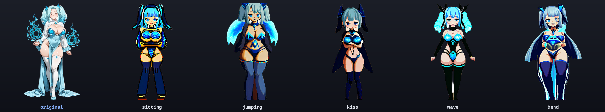
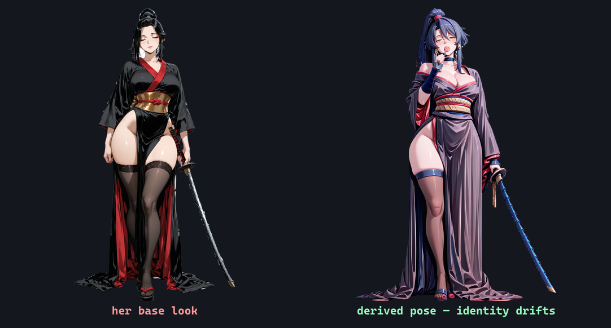

import cover from './cover.png'

export const lab = {
  order: 30,
  title: 'SpriteForge — Keeping Them Consistent',
  description:
    'Re-posing a character into new stances with ControlNet + IPAdapter, where that approach drifts, and the plan to lock a character’s exact look with a per-character LoRA — the key to poses, gear swaps, and stable animation.',
  abstract: (
    

      A game needs the <em>same</em> character in many poses — and eventually in different gear. This is
      how I re-pose a character while keeping their look, exactly where that drifts, and why a per-character
      LoRA is the real answer for game-grade consistency.
    

  ),
  startDate: '2026-06-15',
  date: '2026-06-15',
  image: cover,
  href: '/lab/spriteforge/consistency',
  status: 'In progress',
  type: 'Dev Log / Part 3',
  tags: ['ControlNet', 'OpenPose', 'IPAdapter', 'Per-character LoRA'],
}

export const metadata = {
  title: lab.title,
  description: lab.description,
  robots: { index: false, follow: false },
}

Part of the **[SpriteForge](/lab/spriteforge)** dev log.

## Re-posing a character

A roster of standing splash-art is a start, but a game needs the *same* character attacking, casting,
sitting, waving. Redrawing by hand or re-rolling the prompt both lose the character. The pipeline keeps
them by combining two controls in one generation:

- **Pose** comes from **ControlNet OpenPose**, driven by a small library of reusable pose skeletons.
- **Identity** comes from **IPAdapter** running on the character's *own* sprite, plus their text keywords.

A reusable pose library means any character can be dropped into any of these stances on demand. (One bug
worth the detour: the identity kept drifting to a generic blue, because the transparent sprite was handing
the model a black image. Flattening the reference onto white — how the character was generated — fixed it.)

## Where it drifts — and the real fix

ControlNet + IPAdapter is great for "same character, new pose, *pretty close*." But it reads a character
**semantically**, not pixel-for-pixel — so the exact face and outfit drift, especially in big poses or when
you add a prop:

That's the samurai with a prop added: the pose and prop land, but her black hair has shifted blue and the
kimono's colours have wandered. For a game — where she'll appear in dozens of poses, animations, and
eventually *different gear* — "pretty close" isn't enough.

The real tool is a **per-character LoRA**: train a tiny model on ~20–30 images of one character (which the
pose pipeline above helps generate), and afterwards *any* pose, expression, outfit, or animation frame
renders with her exact face and body locked in. The semantic approach is the bootstrap; the LoRA is the
payoff. That's the piece I'm building next.

**Next: [Animating them →](/lab/spriteforge/animation)**
