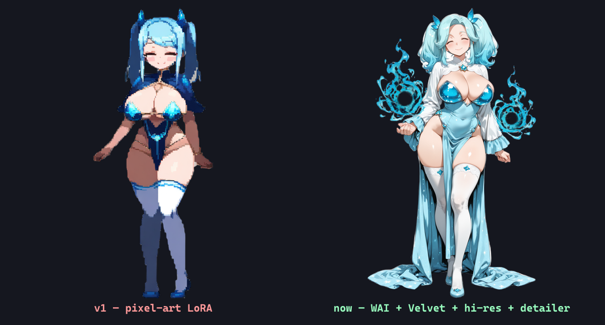

import cover from './cover.png'

export const lab = {
  order: 20,
  title: 'SpriteForge — Finding the Style',
  description:
    'Why pixel art was the wrong fit for the game, and the move to a smooth checkpoint plus a style LoRA, a hi-res pass, a face/hand detailer, and best-of-N curation — the stack that produced the current premium gacha-style roster.',
  abstract: (
    

      The first roster was pixel-art, and it fought me at every step — blurry up close, rough edges, hard
      to keep consistent. This is the path from there to a crisp, premium gacha look, one deliberate
      quality lever at a time.
    

  ),
  startDate: '2026-06-15',
  date: '2026-06-15',
  image: cover,
  href: '/lab/spriteforge/finding-the-style',
  status: 'Done',
  type: 'Dev Log / Part 2',
  tags: ['Illustrious', 'WAI', 'Style LoRA', 'Hi-res fix', 'Face Detailer', 'Curation'],
}

export const metadata = {
  title: lab.title,
  description: lab.description,
  robots: { index: false, follow: false },
}

Part of the **[SpriteForge](/lab/spriteforge)** dev log.

## Pixel art was the wrong fit

The roster started in a pixel-art style (a pixel LoRA on an anime model). It looked characterful at a
glance, but up close it was **blurry and mushy**, its hard aliased edges **fought the cutout step**
(half the reason the [edge problem](/lab/spriteforge/transparent-edges) was so painful), and it was hard
to keep crisp and consistent. For a cute/sexy gacha game with poses and animation, pixel art is about the
worst-fit style you can pick.

The fix was to stop fighting it and **switch to a smooth, high-detail anime style**. Same character, same
prompts — a completely different ceiling:

## One quality lever at a time

From there it was a series of deliberate upgrades, each tested before keeping:

1. **A smooth checkpoint (WAI-illustrious).** Crisp linework, detailed faces, and clean anti-aliased edges
   that *matte beautifully* — the cutout problem mostly dissolved once the source stopped being pixelated.
2. **A style LoRA (at 0.6).** Bake-offs at several strengths showed a moderate weight adds richer, more
   ornate detail and a premium "gacha-card" pop without going busy or breaking the edges.
3. **A hi-res second pass.** Render, upscale the latent, and refine at low denoise — sharper detail, and it
   fixes the hands and limbs that diffusion gets wrong most.
4. **A face & hand detailer.** Auto-detect the face (and hands) and re-render them at high resolution. The
   floor-raiser: it rescues the characters whose faces come out off-model — which matters enormously for the
   consistency work to come.
5. **Best-of-N curation.** Generate a few variants per character and keep the cleanest, so no subtle glitch
   slips into the foundation.

## The result

Ten classes, cohesive, crisp, clean-edged — a foundation strong enough to build identity LoRAs and
animation on top of.

**Lesson:** the *checkpoint and style* decide more about the final look than any amount of prompt-tweaking,
and the right time to lock them is **before** building anything (LoRAs, poses) on top.

**Next: [Keeping them consistent →](/lab/spriteforge/consistency)**
