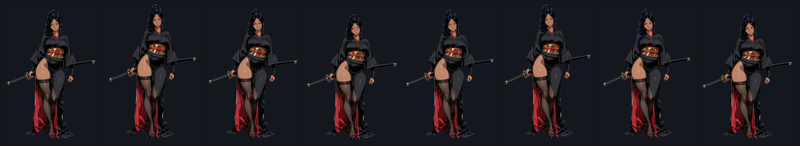
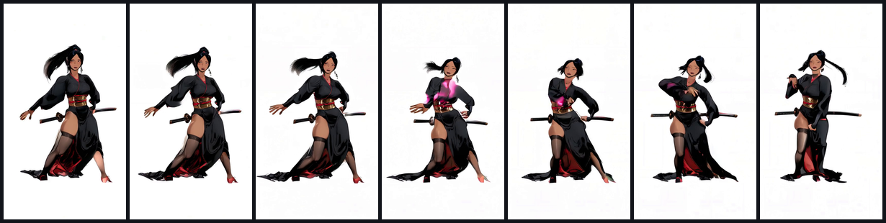
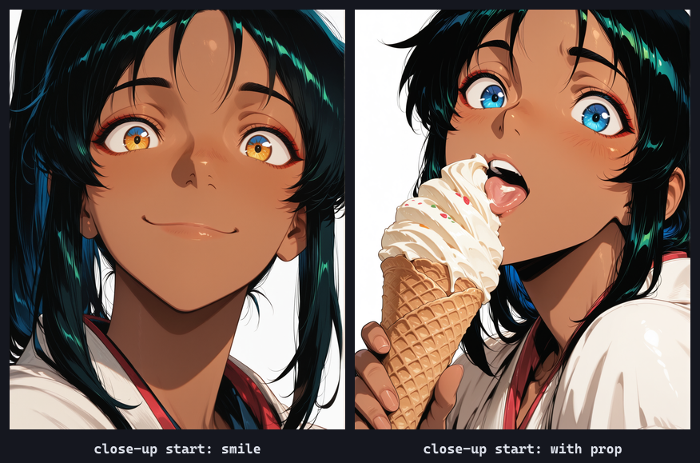

import cover from './cover.png'

export const lab = {
  order: 50,
  title: 'SpriteForge — Bringing Her to Life',
  description:
    'Turning a consistent AI character into motion: the honest journey from failed image-to-video, through procedural rigs, to Wan 2.2 Animate (motion-driven) actually working — and using image-to-video for standalone action clips. What works, what doesn’t, and why.',
  abstract: (
    

      Once a character is consistent, the next frontier is <em>motion</em> — for in-game animation and for
      standalone short clips. This is the honest, ongoing log of getting there: the dead ends, the
      breakthrough (a good driving video), and the recipe that finally produced clean, on-model animation.
    

  ),
  startDate: '2026-06-15',
  date: '2026-06-15',
  image: cover,
  href: '/lab/spriteforge/motion',
  status: 'In progress',
  type: 'Dev Log / Part 5',
  tags: ['Wan 2.2', 'image-to-video', 'Animate', 'Animation', 'ComfyUI'],
}

export const metadata = {
  title: lab.title,
  description: lab.description,
  robots: { index: false, follow: false },
}

Part of the **[SpriteForge](/lab/spriteforge)** dev log. Builds on the [per-character LoRA](/lab/spriteforge/consistency) — motion only matters once the character is *consistent*.

## Two goals
1. **In-game animation** (idle, attack) for the game itself.
2. **Standalone short clips** (a few seconds of her doing something) to reuse across projects.

Both need the same thing: *her, moving, without falling apart.* That turned out to be the hard part, and the road was full of dead ends worth recording.

## What didn't work (and why)
- **Image-to-video with a calm prompt (Wan 2.1).** The model took "minimal motion" literally and animated *only the background* — she stood dead still while the lighting drifted. Wrong tool for controlled character motion.
- **Procedural whole-sprite transforms.** Squash/stretch + sway on the flat sprite. It moves, but it reads as *bouncing* — there's no articulation, because nothing is moving independently.

The lesson: a flat sprite can only bounce; real motion needs either *parts* (a rig) or a *video model that understands bodies*.

## What worked: Wan 2.2 Animate (motion-driven)
The breakthrough was **Wan 2.2 Animate** — you give it a **driving video** and it maps that exact motion onto your character, keeping the identity. The first attempt looked terrible... because the driving clip was a bad, torso-cropped match. Swap in a *clean, full-body* driver and it nails it:

That's her — kimono, katana, dark skin, ponytail all intact — actually dancing, full-body, on a clean background. **The driving video is everything**: garbage in, garbage out; a good one in, real motion out.

## Standalone action clips: image-to-video from a LoRA frame
For *arbitrary* actions where there's no driving video, the route is **Wan 2.2 image-to-video** from a start frame the **LoRA** generates (so it's unmistakably her). For face-focused clips, a **close-up start frame** is the trick — the whole frame is high-detail face, which kills the distortion that plagues full-body video:

A **first-frame + last-frame** setup gives explicit control over the action (define the start and end pose; the model fills the motion between), and a per-frame **face detailer** keeps features crisp.

## What I learned about distortion
Early clips warped the face and body. The causes, in order: **(1) low resolution** — at 480p the face is too few pixels to survive motion; **(2) extreme motion** — a fast dance is the worst case; **(3) no face cleanup**. The fixes: higher resolution, gentler motion, close framing, and a face-detailer pass.

## Where it's going
- Dial in clean **close-up action clips**, then extend from ~2 s toward **5–10 s** (clip chaining + RIFE frame interpolation).
- For in-game motion, the practical path is procedural **part** animation (using segmented layers) or **Live2D/Spine** rigging — reserving the video models for showpiece/marketing clips.
- Replicate the whole stack (LoRA → motion) across the rest of the roster.

A living log — this is the current frontier, updated as it moves.

**Back to the [SpriteForge hub →](/lab/spriteforge)**
