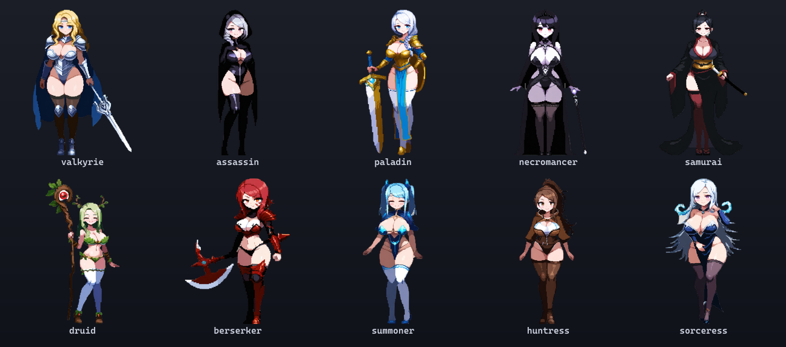
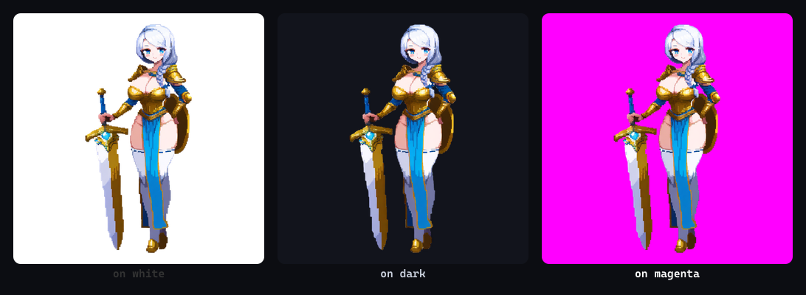
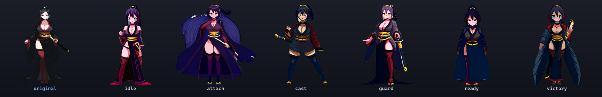

import cover from './cover.png'

export const lab = {
  order: 0,
  title: 'SpriteForge',
  description:
    'A local, reusable pipeline that turns text prompts into game-ready character sprites — generated, cleanly cut out, re-posed with a consistent identity, and animated — all on my own GPU. Built once, shared across every game I make.',
  abstract: (
    <p>
      A from-scratch art pipeline for my games: generate characters locally with Stable Diffusion,
      cut them out with genuinely clean transparent edges (alpha matting), and re-pose the same
      character into new stances without redrawing them. Extracted out of one game into a standalone,
      config-driven toolkit so it can serve all of them.
    </p>
  ),
  startDate: '2026-06-01',
  date: '2026-06-15',
  image: cover,
  href: '/lab/spriteforge',
  status: 'In development',
  type: 'Tool / Art Pipeline',
  tags: ['Stable Diffusion', 'ComfyUI', 'Alpha Matting', 'ControlNet', 'IPAdapter', 'Node.js', 'sharp'],
}

export const metadata = {
  title: lab.title,
  description: lab.description,
  robots: { index: false, follow: false },
}

## Why this exists

Every character in my side-project games is generated **locally**, on my own RTX 4090, from a text
prompt — no paid services, no stock art. That started as a pile of scripts inside one game. But the
hard-won parts — getting *clean transparent edges* and *the same character in new poses* — aren't
game-specific at all. So I pulled them out into **SpriteForge**: a standalone, config-driven toolkit
that any of my games can point at. Each game supplies a small config (its roster, art direction, and
output folders); SpriteForge does the rest.

This page is a living dev log of that toolkit and where it stands today.

## The roster it produces



Ten character classes, each generated from a one-line prompt and cut out to a clean transparent
sprite. The art direction (here: a cute, sexy gacha-splash style) lives entirely in the config — swap
it and the same pipeline produces a completely different look.

## The stack

| Piece | Tool |
|---|---|
| Image model | **Illustrious-XL** (SDXL) via **ComfyUI**, driven over its HTTP API |
| Style | a pixel-art **LoRA** for a consistent look |
| Background detection | **BiRefNet** (semantic — understands *"this shape is a character"*) |
| Pose control | **ControlNet OpenPose** + **IPAdapter** (identity) |
| Animation | **Wan 2.1 image-to-video** + a matching animation LoRA |
| Asset processing | **Node.js + sharp** (the matting, trimming, packing) + **ffmpeg** (animated WebP) |

Everything talks to ComfyUI over its API, so there's no GUI wiring — a few commands drive the whole thing.

## The edge fix: alpha matting

This was the deepest rabbit hole, and it's the reason the toolkit exists. When you generate a character
on a solid background, the pixels *right on the silhouette edge* are a **blend** of the character and
that background. Cut naively, and every edge picks up a faint **halo** that screams against the game's
dark backdrop.

The wrong turns all tried to *delete* the bad pixels — but you fundamentally can't tell a white *halo*
from a white *outfit*. The right answer is a standard technique I should have reached for first: **alpha
matting with colour decontamination**. Instead of keeping the background-blended edge, you **recover its
true colour** by subtracting the background it absorbed:

```
true_color = (pixel − (1 − alpha) · background) / alpha
```

With the soft BiRefNet mask as the alpha and the background sampled from the image corners, every edge
pixel gets its real colour back. The cutout is then clean on **any** background — verified against the
harshest test, bright magenta, where any leftover fringe would be obvious:



That's the hardest case — silver hair, gold armour, white stockings, all light-on-light — and there's
no halo on any background. No outline, no heuristics, no whack-a-mole. The whole messy post-processing
pipeline got deleted and replaced with this one principled step.

## Consistent re-posing: same character, new stance

The newest piece. A roster of standing splash-art is a start, but a game needs the *same* character in
different poses — attacking, casting, guarding. Redrawing by hand or re-rolling the prompt both lose the
character. SpriteForge keeps them:

- **Pose** comes from **ControlNet OpenPose**, driven by a small library of reusable pose skeletons.
- **Identity** comes from **IPAdapter** running on the character's *own* sprite, plus their text keywords.



The leftmost is the original; the rest are generated. Same black-haired samurai, same dark kimono, gold
obi, and katana — now idle, attacking, casting, guarding, and so on, each cut out clean.

One subtle bug was worth the whole detour: the identity first drifted to a generic blue every time.
The cause was that the sprite is *transparent*, so the model was being handed a black image and starved
of colour. Flattening the reference onto **white** — how the character was originally generated — fixed
it instantly. It's "pretty close," not pixel-exact (a per-character LoRA is the heavier ceiling), but it
needs zero training and runs in seconds per pose.

## Animation

Characters can also be animated with **Wan 2.1 image-to-video**: feed it a sprite plus a motion prompt
and it generates a short clip in the matching style. A packing step removes each frame's background,
aligns the frames so the character doesn't jitter, and emits both a game-ready spritesheet and a
shareable transparent animated **WebP**. This is the next area of focus.

## How it's built

The toolkit is deliberately small and engine-agnostic:

```
lib/    comfy.mjs (API client) · matte.mjs (the alpha matting) · graphs.mjs (workflows)
bin/    forge (generate) · poses (build pose library) · repose (re-pose) · pack (animation)
poses/  the reusable pose-skeleton library, shared across games
```

A game adds a config and runs a command:

```bash
node bin/forge.mjs  --config mygame.config.mjs              # generate the roster
node bin/repose.mjs --config mygame.config.mjs samurai      # the samurai in every pose
```

## Status & roadmap

- **Generation + matting** *(done)* — clean transparent sprites from a prompt, verified on any background.
- **Consistent re-posing** *(working)* — ControlNet + IPAdapter, identity kept across new stances.
- **Animation** *(next)* — fold the image-to-video step into the toolkit and scale it across the roster.
- **Later** — per-character LoRAs for pixel-exact identity, and an expanded pose/expression library.

In active development. The first game ([Wayfarer](/games/wayfarer)) already runs on it; the point of
pulling it out is that the next one won't have to rebuild any of this.
