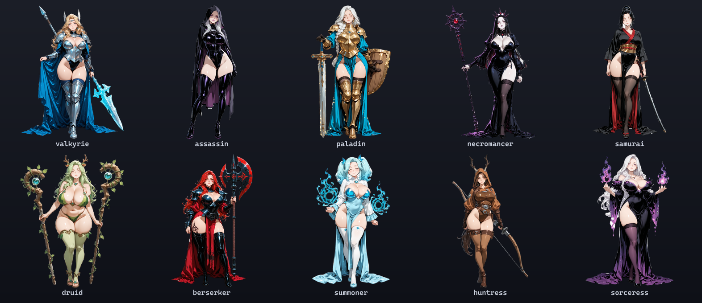

import cover from './cover.png'

export const lab = {
  order: 0,
  title: 'SpriteForge',
  description:
    'A local, reusable pipeline that turns text prompts into game-ready character sprites — generated, cleanly cut out, re-posed with a consistent identity, and animated — all on my own GPU. A living dev log of building it, from the first rough sprites to a premium gacha-style roster.',
  abstract: (
    <p>
      A from-scratch art pipeline for my games: generate characters locally with Stable Diffusion, cut
      them out with genuinely clean transparent edges, re-pose them, and animate them — and turn that
      into a reusable toolkit. This is the hub; the build is split into linkable parts below so each
      stays readable.
    </p>
  ),
  startDate: '2026-06-01',
  date: '2026-06-15',
  image: cover,
  href: '/lab/spriteforge',
  status: 'In development',
  type: 'Tool / Art Pipeline',
  tags: ['Stable Diffusion', 'ComfyUI', 'Alpha Matting', 'ControlNet', 'IPAdapter', 'Wan i2v', 'Node.js'],
}

export const metadata = {
  title: lab.title,
  description: lab.description,
  robots: { index: false, follow: false },
}

## What it is

Every character in my side-project games is generated **locally**, on my own RTX 4090, from a text
prompt — no paid services, no stock art. The hard-won parts (clean transparent edges, the *same*
character in new poses, animation) aren't game-specific, so I pulled them into **SpriteForge**: a
standalone, config-driven toolkit any of my games can point at.

This page is a living dev log. Because it's grown a lot, the story is split into parts — read them in
order to follow the journey, or jump to whatever interests you.

## Where it started → where it is

The first roster was pixel-art. It looked rough up close, fought the cutout step, and was hard to keep
consistent. After a lot of iteration the pipeline now produces a crisp, premium gacha-style roster:



…where the very first version looked like this:


The rest of this log is *how* that happened — and where it's going next.

## The parts

- **[Clean transparent edges →](/lab/spriteforge/transparent-edges)** — the multi-session saga of
  cutting characters out without a white halo, and the standard technique (alpha matting) that finally
  solved it.
- **[Finding the style →](/lab/spriteforge/finding-the-style)** — why pixel art was the wrong fit, and
  the move to a smooth checkpoint + a style LoRA + a hi-res pass + a face/hand detailer + best-of-N
  curation that produced the current roster.
- **[Keeping them consistent →](/lab/spriteforge/consistency)** — re-posing a character with ControlNet
  + IPAdapter, where that drifts, and the plan to lock identity with a per-character LoRA (for poses,
  gear swaps, and animation).
- **[Animating them →](/lab/spriteforge/animation)** — turning a static sprite into motion with Wan 2.1
  image-to-video, in the smooth style.

## How it's built

The toolkit is deliberately small and engine-agnostic — a few commands a game runs against its own config:

```
lib/    comfy.mjs (API client) · matte.mjs (the alpha matting) · graphs.mjs (workflows)
bin/    forge (generate) · poses (build pose library) · repose (re-pose) · curate (best-of-N) · animate (i2v)
```

## Roadmap

- **Generation + clean edges** *(done)* — crisp transparent sprites from a prompt, verified on any background.
- **Premium style** *(done)* — smooth checkpoint + style LoRA + hi-res + face/hand detailer + curation.
- **Consistency** *(solved)* — a per-character LoRA locks the exact look: same face, any pose, any gear.
- **Animation** *(prototyping)* — image-to-video, then folded into the toolkit and scaled across the roster.

In active development. The first game ([Wayfarer](/games/wayfarer)) already runs on it; the point of
pulling it out is that the next one won't have to rebuild any of this.
